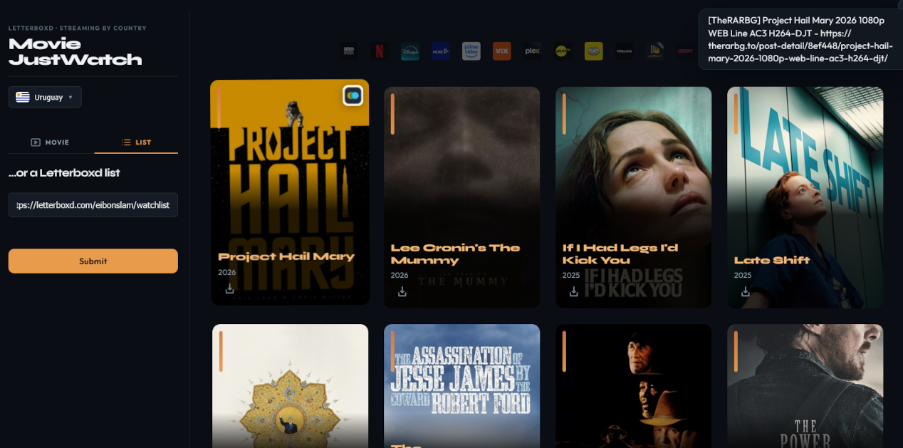

# Letterboxd Movie JustWatch

<div align="center">



<br />

[](https://github.com/DiegoFleitas/letterboxd-movie-justwatch/actions/workflows/ci.yml)

**Scan public Letterboxd watchlists and custom lists, then see where each title streams in your country—without JustWatch’s recommendation layer.**

[Features](#features) · [Quick start](#quick-start) · [Documentation](#documentation)

</div>

---

## Overview

This application connects **Letterboxd** lists to **streaming availability** for a country you choose. It uses **unofficial** JustWatch-style data for lean, title-focused results (no extra recommendation UI). Optional **Jackett** integration helps surface harder-to-find titles through an alternative search path.

| Aspect         | Detail                                                                       |
| -------------- | ---------------------------------------------------------------------------- |
| **Input**      | Public Letterboxd watchlist or custom list URL                               |
| **Output**     | Per-title streaming providers for the selected country                       |
| **Caching**    | Redis-backed cache to limit repeat external requests                         |
| **Operations** | CI on GitHub Actions; deploy to **Fly.io** with Sentry-ready frontend builds |

## Features

| Capability             | Details                                                                                                            |
| ---------------------- | ------------------------------------------------------------------------------------------------------------------ |
| **Lists**              | Paste a Letterboxd watchlist or list URL; titles are resolved from Letterboxd.                                     |
| **Country-aware**      | Pick a country to see which services carry each film there.                                                        |
| **Caching**            | Redis reduces load on upstream calls—see [`redis/README.md`](redis/README.md) for CLI, export, and seed workflows. |
| **Alternative search** | Optional Jackett integration for titles that are difficult to match.                                               |

## Tech stack

| Area            | Stack                                                                         |
| --------------- | ----------------------------------------------------------------------------- |
| **Frontend**    | React 19, Vite (`src/client/`)                                                |
| **Backend**     | Bun, Fastify, TypeScript (`src/server/main.ts`, `src/server/createServer.ts`) |
| **Data & HTTP** | Cheerio (Letterboxd), axios, ioredis; sessions via Fastify                    |
| **Quality**     | Vitest, Playwright, ESLint, Prettier, Husky                                   |

## Prerequisites

- **[Bun](https://bun.sh)** — version is pinned via `packageManager` in `package.json` (lockfile: `bun.lock`). This repository targets Bun only; there is no in-repo Node version pin.

## Quick start

1. Install dependencies (installs Husky via `prepare`):

   ```bash
   bun install
   ```

   If Git hooks are missing after cloning, run `bun run prepare`.

2. Copy environment defaults and set required values:

   ```bash
   cp .env.example .env
   ```

   At minimum, configure **`FLYIO_REDIS_URL`** and **`OMDB_API_KEY`** (posters). For production, set **`APP_SECRET_KEY`** (≥ 32 characters for sessions). See the **[Configuration](https://github.com/DiegoFleitas/letterboxd-movie-justwatch/wiki/Configuration)** wiki page for the full variable list.

3. Start the development servers (Vite on **5173**, Fastify on **3000**—see `concurrently` in `package.json`):

   ```bash
   bun run dev
   ```

4. Open **`http://localhost:5173`**. The dev UI proxies API traffic to the backend per Vite configuration.

### Docker Compose

```bash
docker compose up --build
```

Then open **`http://localhost:3000`**. Provide secrets (`OMDB_API_KEY`, `APP_SECRET_KEY`, and others) via a root `.env` or `docker-compose.override.yml`; Compose loads `.env` automatically.

### Production deploy (Fly.io)

Deployments run from **GitHub Actions** ([`.github/workflows/fly-deploy.yml`](.github/workflows/fly-deploy.yml)): after **CI** succeeds on `main` or `master`, or when the workflow is triggered manually (**workflow_dispatch**). The job runs `bun run build` (for Sentry source maps), `bun run sentry:release:frontend`, then `flyctl deploy --remote-only` with `SENTRY_RELEASE` from the commit.

The `bun run fly:*` scripts are optional helpers for logs, SSH, or ad hoc `flyctl deploy` from your machine.

## Documentation

Operational detail (scripts, environment, layout, observability, branding) lives in the **[GitHub Wiki](https://github.com/DiegoFleitas/letterboxd-movie-justwatch/wiki)**. Source Markdown for those pages is in **[`docs/wiki/`](docs/wiki/)** so changes can be reviewed in pull requests; see [`docs/wiki/README.md`](docs/wiki/README.md) for how to sync the wiki git repository.

| Topic                              | Wiki                                                                                                   |
| ---------------------------------- | ------------------------------------------------------------------------------------------------------ |
| Bun scripts                        | [Commands](https://github.com/DiegoFleitas/letterboxd-movie-justwatch/wiki/Commands)                   |
| Environment variables              | [Configuration](https://github.com/DiegoFleitas/letterboxd-movie-justwatch/wiki/Configuration)         |
| Sentry, Fastify logging, redaction | [Sentry and logger](https://github.com/DiegoFleitas/letterboxd-movie-justwatch/wiki/Sentry-and-logger) |
| Observability overview             | [Observability](https://github.com/DiegoFleitas/letterboxd-movie-justwatch/wiki/Observability)         |
| Paths and folders                  | [Repository layout](https://github.com/DiegoFleitas/letterboxd-movie-justwatch/wiki/Repository-layout) |
| README banner and social preview   | [Branding](https://github.com/DiegoFleitas/letterboxd-movie-justwatch/wiki/Branding)                   |

## Contributing

Before opening a pull request, run:

```bash
bun run lint && bun run typecheck && bun run test
```

End-to-end details: [`e2e/README.md`](e2e/README.md).

**License:** ISC (see `package.json`).

## JustWatch data notice

This project uses **unofficial** JustWatch-related endpoints for **non-commercial, personal** use only. For commercial use or official data, contact JustWatch. Endpoints may change or stop working without notice; use at your own risk.
