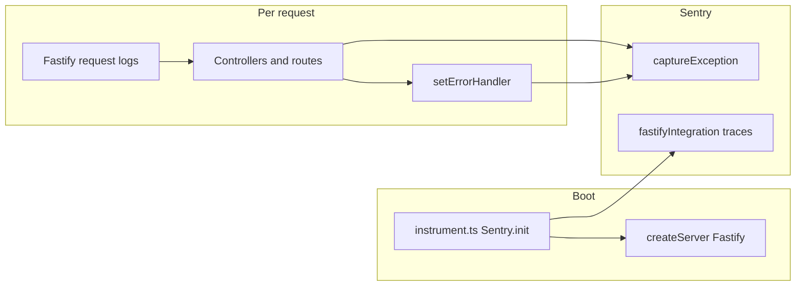

# Sentry integration and Fastify logging

This document describes how server-side error reporting and HTTP logging work in this repo.

## Scope

- **Sentry**:
  - Backend via `@sentry/node` (`instrument.ts`, Fastify handlers)
  - Frontend via `@sentry/react` (`public/src/sentry.ts`) with runtime config injected into `window.__SENTRY_*__`
- **Fastify logger**: request/response logging through Fastify's built-in logger (`logger: true` in `server/createServer.ts`).

## Dependencies

| Package         | Role                                                                                                |
| --------------- | --------------------------------------------------------------------------------------------------- |
| `@sentry/node`  | `Sentry.init`, `captureException`, `fastifyIntegration`, graceful shutdown via `Sentry.close`       |
| `@sentry/react` | Browser error capture and tracing in frontend (`Sentry.init`, `captureException`, `captureMessage`) |
| `@sentry/cli`   | Release/sourcemap upload in deploy flow (`sentry-cli releases ...`)                                 |

## Sentry initialization and lifecycle

1. **Entry order** — `server-fastify.ts` imports `./instrument.js` **first**, so environment loading and `Sentry.init` run before the Fastify server is created.

2. **Conditional init** — `instrument.ts` only calls `Sentry.init` when `SENTRY_DSN` is non-empty after trim. With no DSN, the SDK is not initialized and `Sentry.getClient()` checks elsewhere stay false.

3. **Configuration** (see `.env.example`):
   - `environment`: `NODE_ENV` (default `development`)
   - `release`: `SENTRY_RELEASE`
   - `integrations`: `Sentry.fastifyIntegration()` for framework instrumentation
   - `tracesSampleRate`: from `SENTRY_TRACES_SAMPLE_RATE` (clamped 0–1); defaults to **0** in `.env.example` unless you raise it
   - `sendDefaultPii`: only when `SENTRY_SEND_DEFAULT_PII === "true"`

4. **HTTP 5xx capture path** — Application-level exceptions and explicit backend captures go through `Sentry.captureException` in route/error-handler code. There is no extra middleware-level `captureMessage` bridge or active logger/middleware-level HTTP 5xx capture bridge.

5. **Shutdown** — `server-fastify.ts` calls `Sentry.close(2000)` on SIGTERM/SIGINT when a client exists, and on fatal startup errors after `captureException`.

## Frontend Sentry runtime config

Frontend Sentry is initialized in `public/src/sentry.ts`. Configuration is resolved in this order:

1. Runtime globals injected into HTML (`window.__SENTRY_*__`) by `lib/injectRuntimeConfig.ts` from server env in `server/createServer.ts`
2. Vite build-time fallback (`import.meta.env.VITE_SENTRY_*`)

Primary fields:

- `SENTRY_DSN`
- `SENTRY_RELEASE`
- `SENTRY_TRACES_SAMPLE_RATE`
- `SENTRY_SEND_DEFAULT_PII`
- `NODE_ENV` (as frontend environment fallback via injected runtime value)

Using runtime injection keeps one frontend artifact portable across environments without rebuilding for DSN/release changes.

## Sourcemaps and release alignment

Frontend production debugging relies on sourcemaps uploaded to Sentry for the same release identifier used at runtime.

- Build emits hidden sourcemaps (`vite.config.ts` with `build.sourcemap: "hidden"`), so `.map` artifacts are generated for upload without adding browser-facing `sourceMappingURL` references in JS bundles.
- Upload workflow is script-driven:
  - `bun run sentry:release:new`
  - `bun run sentry:release:upload-sourcemaps`
  - `bun run sentry:release:finalize`
  - or combined: `bun run sentry:release:frontend`
- CI automation (`.github/workflows/fly-deploy.yml`) runs `build -> sentry:release:frontend -> flyctl deploy` with one release id from commit SHA.

Required env vars for upload:

- `SENTRY_AUTH_TOKEN`
- `SENTRY_ORG`
- `SENTRY_PROJECT`
- `SENTRY_RELEASE`

In GitHub Actions, configure secrets:

- `SENTRY_AUTH_TOKEN`
- `SENTRY_ORG`
- `SENTRY_PROJECT`
- `FLY_API_TOKEN`

Important: `SENTRY_RELEASE` must be the same value used by both backend and frontend runtime init; otherwise uploaded artifacts will not match incoming events.
The deploy workflow sets `SENTRY_RELEASE` from `${{ github.event.workflow_run.head_sha || github.sha }}` and passes it both to sourcemap upload and Docker build args for runtime alignment.

## Where exceptions are captured

| Location                                     | Behavior                                                                                                  |
| -------------------------------------------- | --------------------------------------------------------------------------------------------------------- |
| `server/createServer.ts` (`setErrorHandler`) | `captureException` with `extra: { method, url }`; also sends a subset to PostHog when configured          |
| `controllers/letterboxdLists.ts`             | In `fetchList` catch (non-404 paths): `captureException` with `extra: { route: "letterboxd-list-fetch" }` |
| `controllers/letterboxdPoster.ts`            | On errors other than 403/404: `captureException` with `extra: { route: "letterboxd-poster", filmSlug }`   |
| `server-fastify.ts`                          | Top-level `main().catch`: `captureException` for startup failure                                          |

Most captures are guarded with `if (Sentry.getClient())` so behavior is safe when Sentry is disabled.

## Fastify logging in this app

- **Wiring** — `server/createServer.ts` creates the app with `logger: true`.

- **Output** — Pino-formatted JSON logs from Fastify request lifecycle logging.

- **Sentry bridge** — There is no logger-triggered Sentry message capture for HTTP 5xx. Sentry reporting is handled by explicit `captureException` calls.

- **Access logging model** — One logging system (Fastify/Pino) handles request logging instead of dual logging layers.

## Flow (conceptual)

## Tradeoffs

1. **Single Sentry surface** — Application code uses `captureException`; logs are operational telemetry and do not independently emit Sentry messages.

2. **Simpler dependency graph** — No external request-logging package or dynamic SDK import path for HTTP logging.

3. **Traces** — With default `SENTRY_TRACES_SAMPLE_RATE=0`, performance traces are minimal unless you raise the rate deliberately in production.

## Related files

- `instrument.ts` — DSN gating and Sentry options
- `server/createServer.ts` — Fastify logger configuration and error handler
- `.env.example` — `SENTRY_*` variables for runtime + release workflows
