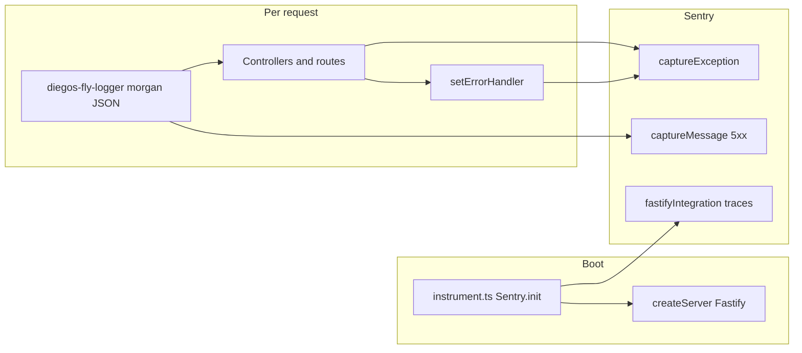

# Sentry integration and `diegos-fly-logger`

This document describes how server-side error reporting and HTTP logging work in this repo.

## Scope

- **Sentry**:
  - Backend via `@sentry/node` (`instrument.ts`, Fastify handlers)
  - Frontend via `@sentry/react` (`public/src/sentry.ts`) with runtime config injected into `window.__SENTRY_*__`
- **`diegos-fly-logger`**: npm package (v2; source lives in the [`diegos-fly-logger`](https://github.com/DiegoFleitas/diegos-fly-logger) repository). It provides structured JSON access logs and an optional path into Sentry for HTTP 5xx responses.

## Dependencies

| Package             | Role                                                                                                                                            |
| ------------------- | ----------------------------------------------------------------------------------------------------------------------------------------------- |
| `@sentry/node`      | `Sentry.init`, `captureException`, `fastifyIntegration`, graceful shutdown via `Sentry.close`                                                   |
| `@sentry/react`     | Browser error capture and tracing in frontend (`Sentry.init`, `captureException`, `captureMessage`)                                             |
| `diegos-fly-logger` | Morgan-based `logging` middleware; JSON one-line logs; optional dynamic `import("@sentry/node")` and `captureMessage` for HTTP 5xx when enabled |
| `@sentry/cli`       | Release/sourcemap upload in deploy flow (`sentry-cli releases ...`)                                                                             |

## Sentry initialization and lifecycle

1. **Entry order** — `server-fastify.ts` imports `./instrument.js` **first**, so environment loading and `Sentry.init` run before the Fastify server is created.

2. **Conditional init** — `instrument.ts` only calls `Sentry.init` when `SENTRY_DSN` is non-empty after trim. With no DSN, the SDK is not initialized and `Sentry.getClient()` checks elsewhere stay false.

3. **Configuration** (see `.env.example`):
   - `environment`: `NODE_ENV` (default `development`)
   - `release`: `SENTRY_RELEASE`
   - `integrations`: `Sentry.fastifyIntegration()` for framework instrumentation
   - `tracesSampleRate`: from `SENTRY_TRACES_SAMPLE_RATE` (clamped 0–1); defaults to **0** in `.env.example` unless you raise it
   - `sendDefaultPii`: only when `SENTRY_SEND_DEFAULT_PII === "true"`

4. **HTTP 5xx flag for the logger** — When a DSN is set, `instrument.ts` sets `process.env.SENTRY_CAPTURE_HTTP_5XX = "true"` if that variable is unset or empty. That turns on middleware-level reporting of HTTP 5xx in `diegos-fly-logger`. Set `SENTRY_CAPTURE_HTTP_5XX=false` explicitly to keep Sentry initialized but skip those captures.

5. **Shutdown** — `server-fastify.ts` calls `Sentry.close(2000)` on SIGTERM/SIGINT when a client exists, and on fatal startup errors after `captureException`.

## Frontend Sentry runtime config

Frontend Sentry is initialized in `public/src/sentry.ts`. Configuration is resolved in this order:

1. Runtime globals injected into HTML (`window.__SENTRY_*__`) by `lib/injectRuntimeConfig.ts` from server env in `server/createServer.ts`
2. Vite build-time fallback (`import.meta.env.VITE_SENTRY_*`)

Primary fields:

- `SENTRY_DSN`
- `SENTRY_RELEASE`
- `SENTRY_TRACES_SAMPLE_RATE`
- `SENTRY_SEND_DEFAULT_PII`
- `NODE_ENV` (as frontend environment fallback via injected runtime value)

Using runtime injection keeps one frontend artifact portable across environments without rebuilding for DSN/release changes.

## Sourcemaps and release alignment

Frontend production debugging relies on sourcemaps uploaded to Sentry for the same release identifier used at runtime.

- Build emits sourcemaps (`vite.config.ts` with `build.sourcemap: true`)
- Upload workflow is script-driven:
  - `bun run sentry:release:new`
  - `bun run sentry:release:upload-sourcemaps`
  - `bun run sentry:release:finalize`
  - or combined: `bun run sentry:release:frontend`
- Deploy shortcut including upload: `bun run fly:deploy:release`

Required env vars for upload:

- `SENTRY_AUTH_TOKEN`
- `SENTRY_ORG`
- `SENTRY_PROJECT`
- `SENTRY_RELEASE`

Important: `SENTRY_RELEASE` must be the same value used by both backend and frontend runtime init; otherwise uploaded artifacts will not match incoming events.

## Where exceptions are captured

| Location                                     | Behavior                                                                                                  |
| -------------------------------------------- | --------------------------------------------------------------------------------------------------------- |
| `server/createServer.ts` (`setErrorHandler`) | `captureException` with `extra: { method, url }`; also sends a subset to PostHog when configured          |
| `controllers/letterboxdLists.ts`             | In `fetchList` catch (non-404 paths): `captureException` with `extra: { route: "letterboxd-list-fetch" }` |
| `controllers/letterboxdPoster.ts`            | On errors other than 403/404: `captureException` with `extra: { route: "letterboxd-poster", filmSlug }`   |
| `server-fastify.ts`                          | Top-level `main().catch`: `captureException` for startup failure                                          |

Most captures are guarded with `if (Sentry.getClient())` so behavior is safe when Sentry is disabled.

## `diegos-fly-logger` in this app

- **Wiring** — `server/createServer.ts` imports `logging` from `diegos-fly-logger/index.mjs` and runs it on Fastify’s `onRequest` hook using the raw Node `IncomingMessage` / `ServerResponse` (`request.raw`, `reply.raw`).

- **Output** — Morgan custom `"json"` format: one JSON object per line (Loki/Grafana friendly). Fields are documented in the [`diegos-fly-logger` README](https://github.com/DiegoFleitas/diegos-fly-logger/blob/main/README.md).

- **Sentry bridge** — When `SENTRY_CAPTURE_HTTP_5XX === "true"`, responses with status `>= 500` trigger a lazy `import("@sentry/node")` and `captureMessage` with the access-line message, level `error`, and tags/extra (method, service, environment, status, url, request id, response time). This is **message**-based reporting for HTTP-level 5xx, distinct from `captureException` unless the same request also throws into the Fastify error handler.

- **Fastify’s own logger** — The Fastify app is created with `logger: true`; `diegos-fly-logger` adds structured access lines in addition to Fastify logging.

## Flow (conceptual)

## Tradeoffs

1. **Two Sentry surfaces** — Application code uses `captureException`; the logger may also send `captureMessage` for HTTP 5xx when enabled. A single 5xx can appear as both an exception event and a message, depending on how the response is produced.

2. **Logger and `@sentry/node`** — The logger does not list `@sentry/node` as a required dependency; it dynamic-imports when the flag is on. This app always installs `@sentry/node`, so that import succeeds when enabled.

3. **Traces** — With default `SENTRY_TRACES_SAMPLE_RATE=0`, performance traces are minimal unless you raise the rate deliberately in production.

## Related files

- `instrument.ts` — DSN gating and Sentry options
- `server/createServer.ts` — Logger hook and error handler
- `.env.example` — `SENTRY_*` and logger-related variables
