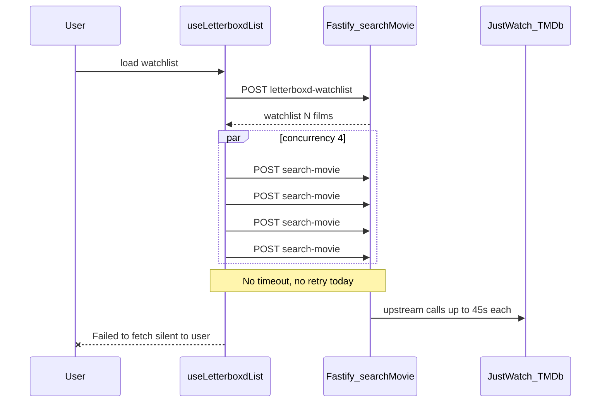

# List-batch fetch resilience (MOVIE-JUSTWATCH-C)

**Goal:** Reduce `TypeError: Failed to fetch` events during list-batch on Android by making client fetches resilient and visible, without changing server search logic.

**Context:** Sentry issue MOVIE-JUSTWATCH-C. Release `a20392c` is a deps-only bump and is not the root cause. Failures occur in [`src/client/src/useLetterboxdList.ts`](../../src/client/src/useLetterboxdList.ts) when parallel `POST /api/search-movie` calls fail at the network layer before any HTTP response. Single-movie search in [`src/client/src/useMovieSearch.ts`](../../src/client/src/useMovieSearch.ts) already shows a user error on fetch failure; list-batch does not.



---

## Root cause (confirmed)

| Gap                      | List batch today                        | Single search |
| ------------------------ | --------------------------------------- | ------------- |
| Retry on network error   | No                                      | No            |
| Client timeout           | No                                      | No            |
| User toast on fetch fail | No (Sentry only)                        | Yes           |
| Concurrent requests      | 4 + unbounded Letterboxd poster fetches | 1             |

Server [`searchMovie.ts`](../../src/server/controllers/searchMovie.ts) can take up to ~45s (JustWatch 15s × 3 retries). List API uses `AbortSignal.timeout(120_000)`; batch searches wait indefinitely until the mobile network drops the connection.

---

## Phase 1 — Client fetch helper (primary fix)

Create [`src/client/src/fetchSearchMovie.ts`](../../src/client/src/fetchSearchMovie.ts) with a small, testable helper used by both list-batch and single search.

**Exports:**

- `SEARCH_MOVIE_TIMEOUT_MS = 60_000`
- `SEARCH_MOVIE_MAX_RETRIES = 2` — 1 initial + 2 retries = 3 attempts total
- `isRetryableFetchError(e: unknown): boolean`
- `fetchSearchMovie(body, signal?): Promise<Response>`

**On final failure in list-batch `.catch`:**

1. Push to `batch.errors` with network message
2. Sentry capture only after retries exhausted; tags `retriesExhausted`, `attempts`
3. Keep batch completion / `showBatchErrors` flow

---

## Phase 2 — Mobile concurrency tuning

`resolveSearchConcurrency()` returns 2 on Android, 4 elsewhere.

---

## Phase 3 — Defer Letterboxd poster fetches

Run poster enrichment after each tile's search task completes.

---

## Phase 4 — Align single search

[`useMovieSearch.ts`](../../src/client/src/useMovieSearch.ts) uses `fetchSearchMovie`.

---

## Phase 5 — Infra follow-ups (separate deploy)

| Item                                | File / action                                                                                         | Why                                                                               |
| ----------------------------------- | ----------------------------------------------------------------------------------------------------- | --------------------------------------------------------------------------------- |
| Deploy in-process cache             | [`memoryCache.ts`](../../src/server/lib/memoryCache.ts) + [`redis.ts`](../../src/server/lib/redis.ts) | Avoid cold upstream on every search when `DISABLE_REDIS=1`                        |
| Deploy before Redis removal         | Fly secrets                                                                                           | Never run `DISABLE_REDIS=1` without memory-cache fallback                         |
| Consider `min_machines_running = 1` | [`fly.toml`](../../fly.toml)                                                                          | Reduce cold-start connection drops during first batch after idle (cost trade-off) |

---

## Phase 6 — Sentry noise control

- Report only when all attempts fail
- `level: "warning"` for network errors
- Fingerprint `["list-batch", "search-movie", "network"]`

---

## Verification

```bash
bun run test -- src/client/src/__tests__/fetchSearchMovie.test.ts src/client/src/__tests__/useLetterboxdList.coverage.test.tsx
bun run lint && bun run typecheck
```

Post-deploy: watch MOVIE-JUSTWATCH-C event rate in Sentry over 7 days.

---

## Implementation status

Implemented in client code (Phases 1–4, 6). Phase 5 remains a separate deploy track.
