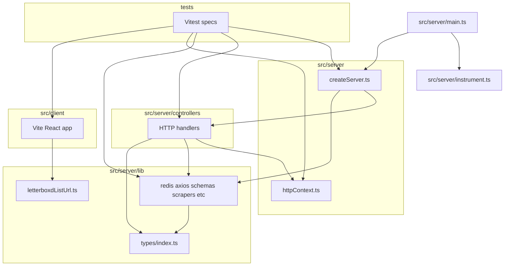

# Folder structure and merge candidates

This document is the outcome of a repository inventory: top-level folders, import boundaries, and whether merging directories is justified. It is maintained in-repo with other wiki sources under `docs/wiki/`.

**Status:** Application source lives under **`src/server/`** (Fastify entry, HTTP handlers, shared backend `lib/`) and **`src/client/`** (Vite React app). Consolidating **`types/` into `lib/types/`** was done earlier (no top-level `types/`). The tables and diagram below reflect the **current** layout.

**How counts were taken:** `find <path> -type f` from the repository root, excluding nothing inside each path (includes images under `docs/`). Re-run when you change structure.

---

## 1. Inventory (top-level)

Counts are **non-hidden files** under each directory. Generated artifacts (`playwright-report/`, `test-results/`) are local test output, not source layout.

| Path              | Purpose                                                                                            | Files | Notes                                                                                                                                          |
| ----------------- | -------------------------------------------------------------------------------------------------- | ----: | ---------------------------------------------------------------------------------------------------------------------------------------------- |
| `src/server/`     | Entry (`main.ts`, `instrument.ts`), `createServer.ts`, `httpContext.ts`, `controllers/`, `lib/`    |     — | Node/Bun backend; `loadCanonicalProviders` reads `resources/data/canonical-providers.json` via path relative to repo root                      |
| `src/client/`     | Vite app: React (`src/`), CSS, static assets                                                       |     — | One cross-import into `src/server/lib/letterboxdListUrl` from `useLetterboxdList.ts`                                                           |
| `resources/data/` | JSON: `canonical-providers.json` (tracked); optional `redis-snapshot.json` (gitignored by default) |     2 | Redis scripts default to `resources/data/redis-snapshot.json`                                                                                  |
| `docs/`           | Wiki sources and branding asset                                                                    |     9 | 8× `docs/wiki/*.md` + `docs/images/github-banner.png`; synced to GitHub Wiki per `docs/wiki/README.md`                                         |
| `e2e/`            | Playwright specs (UI + backend smoke)                                                              |     3 | Does not import `src/server` (Playwright + Node builtins)                                                                                      |
| `redis/`          | Redis image/entrypoint for Docker-style local ops                                                  |     3 | Infra next to `docker-compose.yml`                                                                                                             |
| `scripts/`        | CLI tooling (providers build, fixtures, Redis export/seed)                                         |     4 | Imports `../src/server/lib/*`                                                                                                                  |
| `tests/`          | Vitest unit/integration tests + fixtures                                                           |    28 | Imports `src/server/*`; two files import `src/client/src/*` (see [tests/README.md](../../tests/README.md#cross-layer-imports-from-client-src)) |

**Other top-level (not in table):** `.github/` (workflows, Dependabot), `.husky/` (git hooks), config dotfiles—`vite.config.ts`, `vitest.config.ts`, `playwright.config.ts`, `eslint.config.mjs`, `tsconfig.json`, Docker/Fly files, etc.

**Excluded from “source” inventory:** `node_modules/`, `playwright-report/`, `test-results/` (generated or dependency trees).

---

## 2. Dependency map (imports)

### Summary

- **`src/server/createServer.ts`** registers routes from `controllers/index` and uses `lib/redis`, `lib/loadCanonicalProviders`, `lib/posthog`, `lib/injectRuntimeConfig`.
- **All `src/server/controllers/*.ts`** depend on `httpContext.js` for `HttpHandler` and use multiple `lib/*` modules. **`searchMovie.ts`** imports types from **`../lib/types/index.js`**.
- **`src/server/lib/`** modules **`processOffers`**, **`loadCanonicalProviders`**, **`canonicalProviders`** import **`./types/index.js`**. No `lib/` file imports `controllers/` or `createServer` directly.
- **`src/client/src`** only imports **`letterboxdListUrl`** from **`src/server/lib/`** (from `useLetterboxdList.ts`). Vite must never pull in other server-only `lib` files; today the boundary is a single module.
- **`tests/`** imports `src/server` heavily. **Cross-layer tests:**
  - `tests/stateTileManagement.test.ts` → `../src/client/src/movieTiles.js`
  - `tests/providerDeduplication.test.ts` → `../src/client/src/providerUtils.js`

### Diagram (direction = “depends on”)

---

## 3. Merge candidates (scoring)

Use these criteria for any proposed folder merge:

| Criterion      | Question                                                      |
| -------------- | ------------------------------------------------------------- |
| Same layer     | Backend-only vs UI vs infra—avoid mixing.                     |
| Same consumers | Would one path simplify most callers?                         |
| Risk           | Would client bundlers or Node resolution pull the wrong code? |
| Churn          | Imports, CI, Docker copy paths, docs.                         |

### `types/` merged into `lib/` (implemented as `lib/types/index.ts` under `src/server/lib/types/`)

|            |                                                                          |
| ---------- | ------------------------------------------------------------------------ |
| Same layer | Yes—both are TypeScript shared modules.                                  |
| Consumers  | `searchMovie` + `lib` modules.                                           |
| Risk       | Low; Vite still only imports `letterboxdListUrl` from `src/server/lib/`. |
| Churn      | Done.                                                                    |

**Verdict:** **Completed**.

### `server/` merged with `controllers/`

**Verdict:** **Do not merge** — keep composition (`createServer`) separate from handlers.

### `controllers/` merged with `lib/`

**Verdict:** **Do not merge** — would blur HTTP entrypoints with generic utilities and complicate testing.

### `tests/` merged with `e2e/`

**Verdict:** **Do not merge** — Vitest vs Playwright, different config and runtime.

### Root `data/` moved to `resources/data/`

**Verdict:** **Completed** — `loadCanonicalProviders`, `buildCanonicalProviders`, Redis export/seed scripts, and docs use `resources/data/`. `redis-snapshot.json` remains optional and gitignored; `canonical-providers.json` stays tracked.

### `redis/` merged into application folders

**Verdict:** **Do not merge** — Docker/ops concern, not app source.

### Full `src/server` + `src/client` layout

**Verdict:** **Completed** — former top-level `lib/`, `controllers/`, `server/`, `public/`, and root entry files now live under `src/server/` and `src/client/` (see [Repository-layout.md](Repository-layout.md)).

---

## 4. Recommendations

### Done (clarity)

- **Cross-test boundaries:** [tests/README.md](../../tests/README.md#cross-layer-imports-from-client-src).
- **Narrow `src/client` → `src/server/lib`:** same README section; prefer small helpers (e.g. `letterboxdListUrl`) over many cross-imports from `src/client/src/`.

### Do not merge

- **`src/client/`** with **`src/server/controllers/`** or **`createServer`** — different runtimes (browser vs Node).
- **`e2e/`** with **`tests/`** — different tools.
- **`redis/`** with application code.

---

## 5. If you implement a structural merge later

- Update [Repository-layout.md](Repository-layout.md) in this wiki folder.
- Run `bun run typecheck`, `bun run test`, and `bun run test:e2e` when routes or static paths change.
- After moving shared code under `src/server/lib/`, confirm **Vite** still only resolves the intended client-safe modules.
